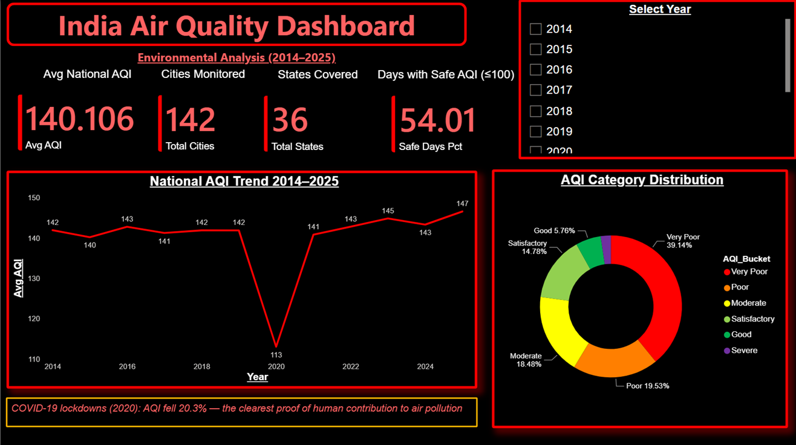
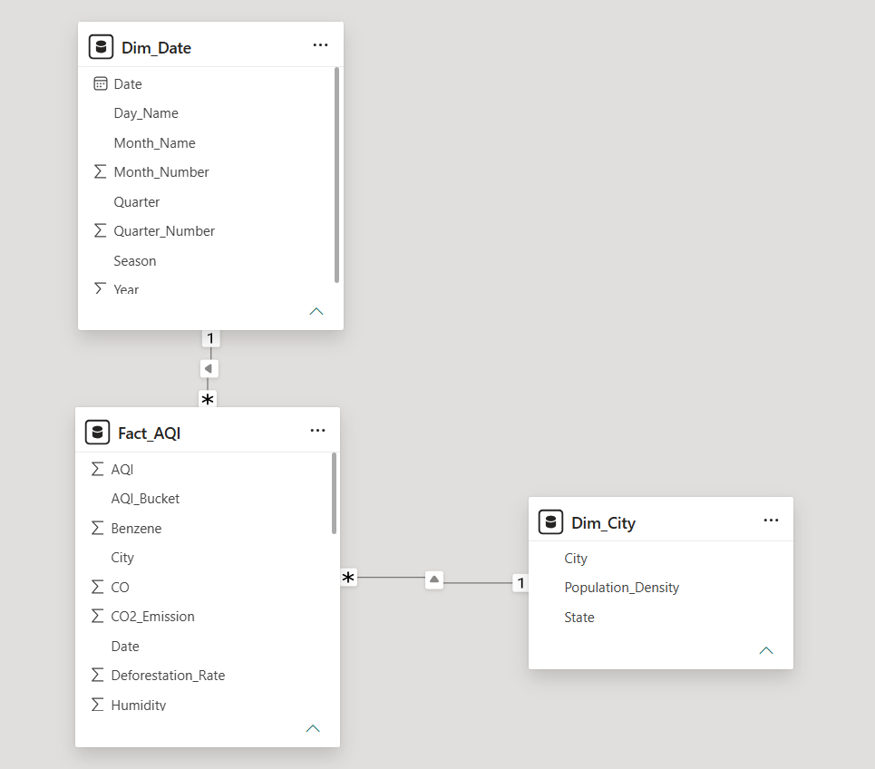

# 🌫️ India Air Quality Dashboard (2014–2025)
### Power BI · Data Analysis · Environmental Analytics

---

## 📌 Project Overview

An end-to-end Power BI dashboard analysing 11 years of air quality 
data across 142 Indian cities and 36 states (2014–2025).
Built using CPCB monitoring data with 20,592 monthly readings 
across 23 variables — pollutant concentrations, meteorological 
factors, CO2 emissions, and deforestation rates.

This project goes beyond standard AQI dashboards by correlating 
air quality with environmental drivers — wind speed, humidity, 
industrial growth, deforestation, and CO2 emissions.

---

## 🔍 Key Findings

| Finding | Value |
|---------|-------|
| National average AQI (2014–2025) | **140.1** |
| Most polluted city | **Ludhiana** (avg AQI 300.1) |
| Cleanest city | **Lunglei, Mizoram** (avg AQI 34.1) |
| COVID-19 AQI improvement (2020) | **-20.3%** vs 2019 |
| Worst month | **December** (avg AQI 215.0) |
| Best month | **August** (avg AQI 74.1) |
| Post-COVID trend | **Worsening** (140.8 → 146.6 by 2025) |

---

## 📊 Dashboard Pages

1. **National Overview** — KPI cards, 11-year AQI trend,
   COVID-19 annotation, AQI bucket distribution
2. **City Deep Dive** — City/state slicers, seasonal patterns,
   worst days table, AQI gauge
3. **Pollutant Analysis** — PM2.5 and CO2 rankings,
   scatter correlations, multi-pollutant trends
4. **Environmental Factors** — Deforestation vs AQI,
   industry growth vs AQI, wind speed vs AQI
5. **Geographic Map** — AQI bubble map across Indian cities
6. **Insights & Recommendations** — Data-backed findings
   and policy recommendations

---

## 🛠️ Tools & Technologies

| Tool | Use |
|------|-----|
| Power BI Desktop | Dashboard and visualisations |
| Power Query (M code) | Data cleaning and transformation |
| DAX | 9 calculated measures including YoY change |
| Git / GitHub | Version control and portfolio hosting |

---

## 🗄️ Data Model

Star schema with three tables:
- Fact_AQI — 20,592 rows, 23 columns
- Dim_Date — date dimension (Year/Month/Quarter/Season)
- Dim_City — 142 cities with state and population density

---

## ⚠️ Data Quality Notes

Two data quality issues were identified during analysis
and are documented here transparently:

**1. PM10 less than PM2.5 anomaly (2,118 rows / 10.3% of data)**
PM10 physically must always be greater than or equal to PM2.5.
2,118 rows in the source data violate this — primarily in smaller
Tier-3 cities. Consistent with known sensor calibration
inconsistencies in CPCB monitoring stations. Rows were retained
to preserve dataset completeness.

**2. Duplicate city name — Udaipur (288 rows)**
Udaipur exists as two distinct cities — one in Rajasthan
(avg AQI 332, Very Poor) and one in Tripura (avg AQI 18, Good).
Both appear as Udaipur in the City column. State-level filtering
correctly separates them.

Identifying and documenting data quality issues is a core
part of real-world data analysis. These findings were flagged
during the audit phase of this project.

---

## 📁 Files in This Repo

| File | Description |
|------|-------------|
| India_AQI_Dashboard.pbix | Main Power BI report |
| data/india_air_quality_2014_2025.csv | Source dataset |
| screenshots/ | Dashboard page previews |
| README.md | This file |

---

## ▶️ How to Use

1. Download India_AQI_Dashboard.pbix
2. Open in Power BI Desktop 
3. If prompted about data source, point it to the data/ folder
4. Use slicers to filter by city, state, or year

---

*Data source: CPCB (Central Pollution Control Board) monitoring data*
*Built by Aarush Sinha | www.linkedin.com/in/aarush-sinha-8250ab2a9
